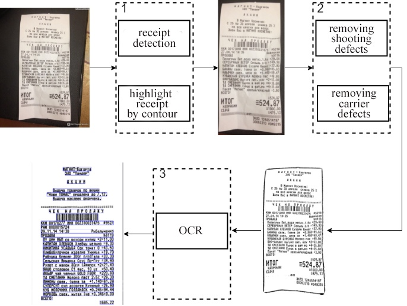

# Receipt recognition algorithm
Internship project with OpenCV

    

The algorithm is able to improve shadow/lights on image, crop the receipt itself, fix skew and detect text via Tesseract engine.

Steps:
- Find and crop image with help of morphological operators
- Denoising and illumination normalization
- Converting to grayscale, gamma, brightness contrast correction and increasing sharpness
- Converting to black and white with adaptive threshold
- Deskewing
- Select text areas and Tesseract them

Source code is located in `target/`, where `client` is http client, `server` is http server and `image_core` is recognition algorithm itself. Samples located in `sample_images`.  
Also you can find images of each step in `misc/process` (not ordered!).